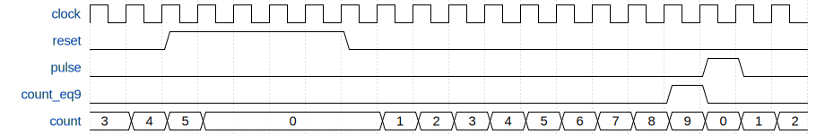

pseudo_hdl
==========

This pseudo HDL simulator were created for my programming learning.
Most of the idea of the simulator comes from Jan Decaluwe's MyHDL.

How to write HDL
----------------

The following is an example of RTL model.

    def timer(clock, reset, pulse):

        count = Signal(0, n=4)
        count_eq9 = Signal(0)

        @Always(clock.posedge)
        def count_LOGIC():
            if reset or count_eq9:
                count.next = 0
            else:
                count.next = count + 1

        @Always(count)
        def count_eq9_LOGIC():
            count_eq9.next = (count == 9)

        @Always(clock.posedge)
        def pulse_LOGIC():
            pulse.next = count_eq9

        return HwModule()

The following is a testbench.

    def timer_tb():

        clock = Signal(0)
        reset = Signal(0)
        pulse = Signal(0)

        u_timer = timer(clock, reset, pulse)
        vcd_info = vcd_dump(u_timer, 'timer.vcd')

        @HwBlock
        def clock_GEN():
            while True:
                clock.next = 0; yield Delay(10)
                clock.next = 1; yield Delay(10)

        @HwBlock
        def reset_GEN():
            reset.next = 0
            for i in range (5):
                yield clock.posedge
            reset.next = 1
            for i in range (5):
                yield clock.posedge
            reset.next = 0

        @HwBlock
        def reset_MON():
            while True:
                yield reset
                print('reset={0} at time {1}'.format(int(reset), now()))

        @HwBlock
        def pulse_MON():
            while True:
                yield pulse
                print('pulse={0} at time {1}'.format(int(pulse), now()))

        @HwBlock
        def finish_simulation():
            yield Delay(700)
            finish('Simulation finished.')

        return HwModule()

Simulate the testbench.

    tb = timer_tb()
    simulate(tb)

The result is as follows.

    $ ./hdl_example.py
    Create VCD file "timer.vcd".
    reset=1 at time 90
    reset=0 at time 190
    pulse=1 at time 390
    pulse=0 at time 410
    pulse=1 at time 590
    pulse=0 at time 610
    Time 700: Simulation finished.

VCD file is created for waveform viewing.
The following is a partial diagram of the waveform.

Classes and Functions
-------------------

    Signal(value, n=1)
        Create a signal object and set the initial value.
        To dump a multi-bit signal, specify the number of bits.
        Properties "next", "posedge" and "negedge" are available.

    Delay(value)
        Create a delay object and set the delay value.

    Always(*signal_or_edges)
        Convert a function to generator function with loop and convert it
        to hw_block object.
        Generator is set as property of the object.

    HwBlock(func)
        Convert a generator function to hw_block object.
        Generator is set as property of the object.

    HwModule()
        Collect objects and their names from stack frame.
        Set object name dictionary to new hw_module and return it.

    simulate(hw_module)
        Execute simulation until finish() is called or no more events.

    now()
        Return current simulation time.

    finish(message)
        Display the message and finish simulation.

    vcd_dump(hw_module, filename)
        Set to dump signals under specified hw_module and submodules.
        Create a vcd_info object, set the properties and return it.
